# Project name: Het Oliemonster (Dutch)
## WordPress theme and plugin

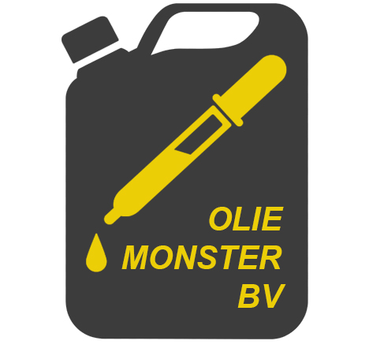

## :books: Description
Project 'Het Oliemonster' is a Dutch project in which I had the task to develop a customer portal.

The project itself is not complete because some features are still missing. You can think of a way for the admin to process the test results which came back from the lab.

## Table of contents

- [Features users](#sparkles-features-users)
- [Features administrator](#sparkles-features-administrator)
- [Features back-end](#sparkles-features-back-end)
- [Made with](#made-with)
- [Screenshots](#screenshots)
  - [Login page](#login-page)
  - [Login page email (error example)](#login-page-email-error-example)
  - [Register page](#register-page)
  - [Register page (errors)](#register-page-errors)
  - [Dashboard user](#dashboard-user)
  - [Requesting a check page (user)](#requesting-a-check-page-user)
  - [Requesting a check page with errors (user)](#requesting-a-check-page-with-errors-user)
  - [Dashboard admin](#dashboard-admin)
  - [Information page admin (previously submitted applications)](#information-page-admin-previously-submitted-applications)
  - [Information page admin edit feature (previously submitted applications)](#information-page-admin-edit-feature-previously-submitted-applications)
  - [Confirmation message editing status (previously submitted applications)](#confirmation-message-editing-status-previously-submitted-applications)

### :sparkles: Features users
Normal users _(you and me)_ have the following features:
1. To create and login into their account
   * Their password can only contain numbers
3. See an overview of their previously submitted applications, including the current status of their application
4. Submit a new application
5. Receive an automatic e-mail when they submit a new application

### :sparkles: Features administrator
Administrators have the following features:
1. See an overview of all previously submitted applications of normal users. This includes the following information:
   * Sample number
   * Customer name
   * Type of research
2. Obtain access and see in the information of previously submitted applications
3. Edit information of previously submitted applications
4. Edit the status of a submitted application
   * Including a confirmation box to make sure the status isn't changed by accident
5. Receive an automatic e-mail when normal users submit a new application

### :sparkles: Features back-end
The back-end has the following features:
1. Automatic creation of the database tables 
2. Automatic insertion of data into the database tables
3. Automatic creation of two new capabilities _(for the User Access Management System that WordPress uses)_
   * For 'administrator': oliepor_admin_view_dashboard
   * For 'subscriber': oliepor_subscriber_view_dashboard

Both capabilities are introduced in order to show the right dashboard to the user (the admin needs to see a different dashboard than the user)

These features are introduced so the developer does not have to create the database tables, insert the data into these tables, and create the two capabilities by him/herself.

### Made with
- WordPress version 6.0
- HTML(5)
- Bootstrap
- CSS and SCSS
- JavaScript (+ES6)
- PHP (Object-Oriented Programming)
- GitHub
- Git

## Screenshots
This section includes all the screenshots of the application.
As mentioned earlier, this is a Dutch project, and therefore the language in the screenshots is also Dutch.

### Login page
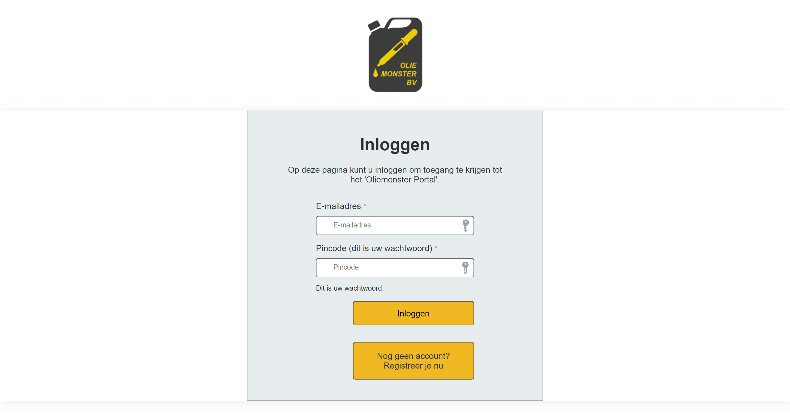

### Login page (email error example)
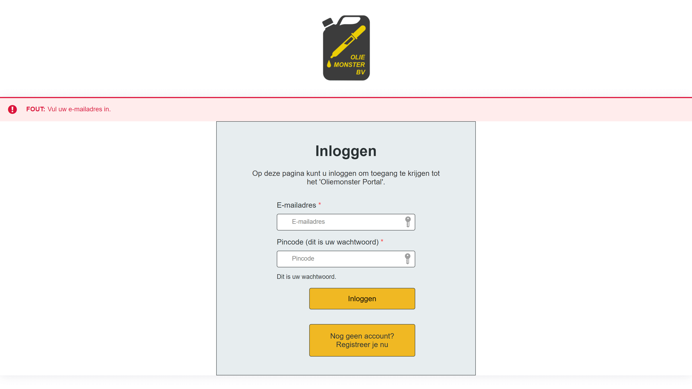

### Register page
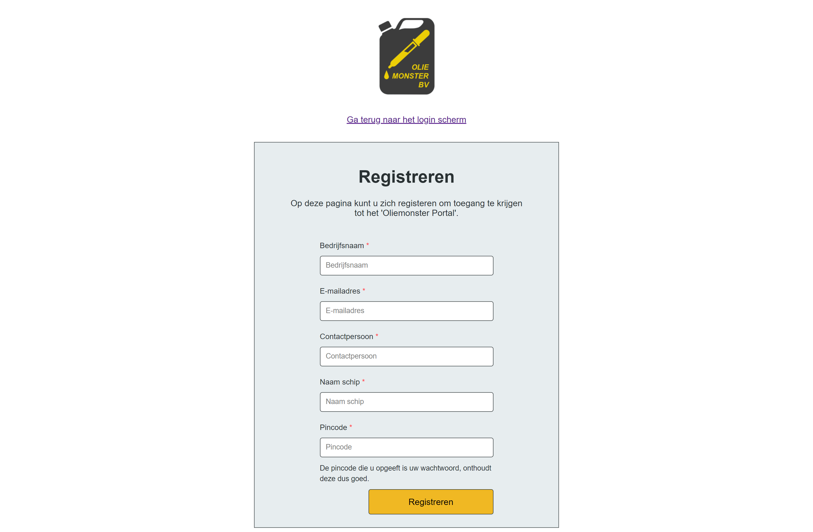

### Register page (errors)
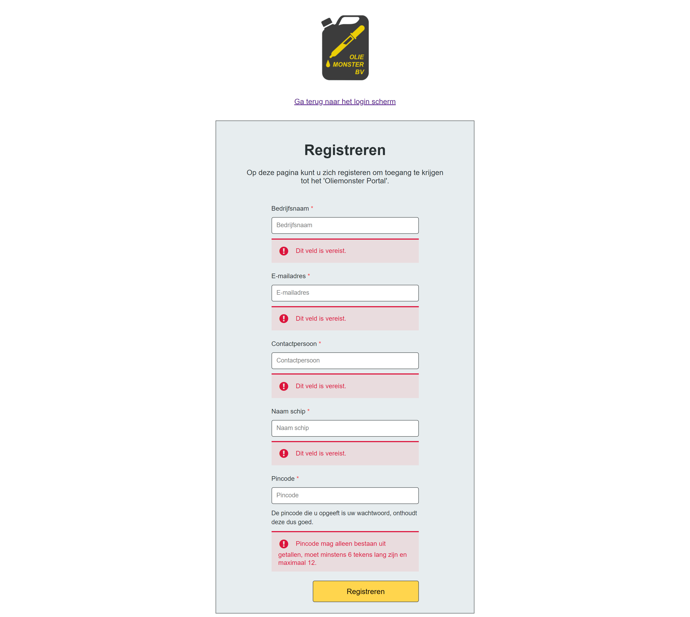

### Dashboard user
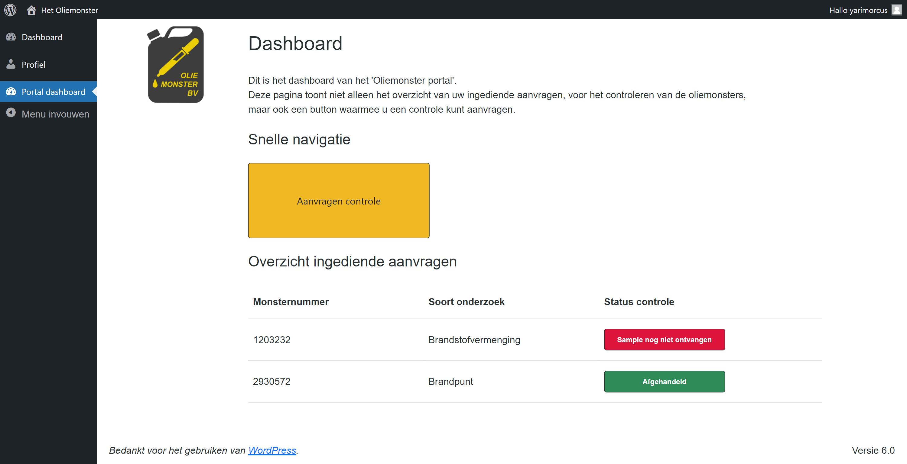

### Requesting a check page (user)
❗The whitespace on the left under the navigation menu is behavior that occurred when taking the screenshot.
Under normal circumstances (when scrolling the page), the navigation is fixed, and this whitespace will not be visible.

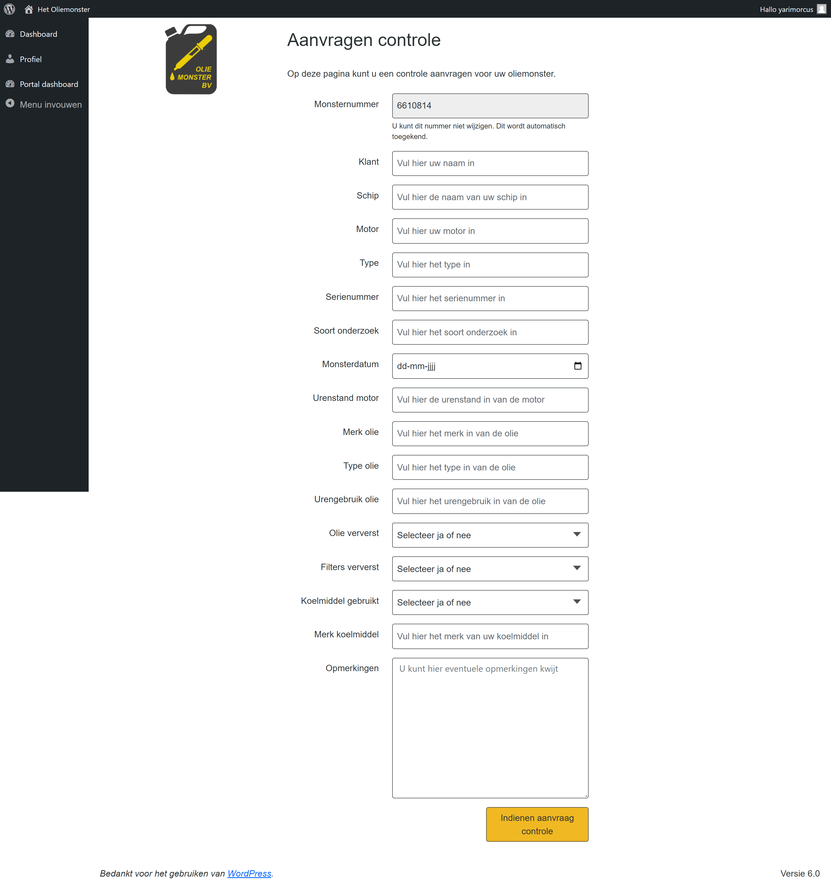

### Requesting a check page with errors (user)
❗The whitespace on the left under the navigation menu is behavior that occurred when taking the screenshot.
Under normal circumstances (when scrolling the page), the navigation is fixed, and this whitespace will not be visible.

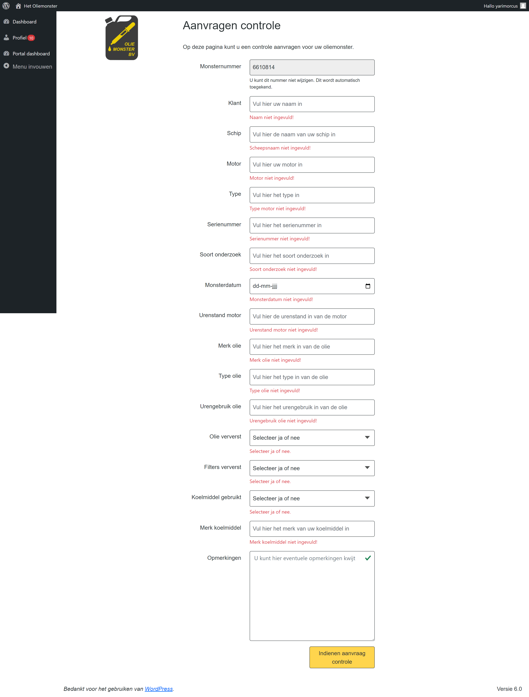

### Dashboard admin
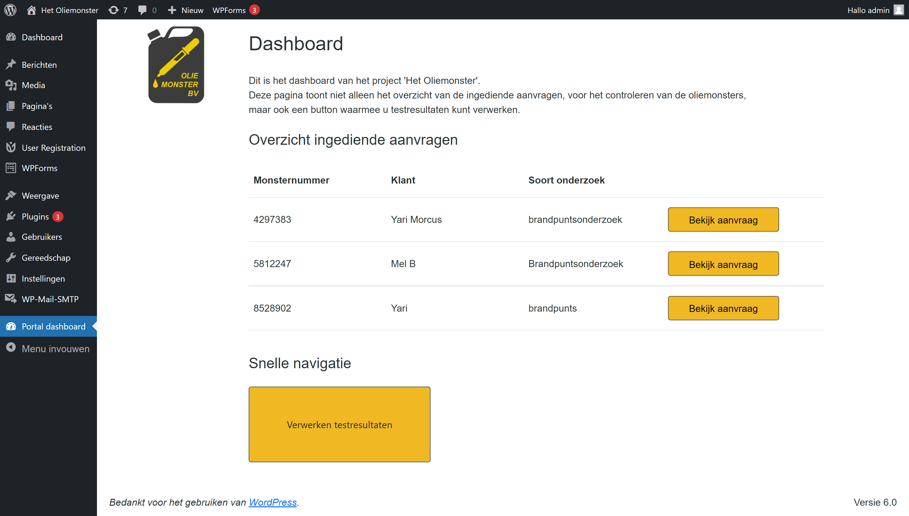

### Information page admin (previously submitted applications)
❗The whitespace on the left under the navigation menu is behavior that occurred when taking the screenshot.
Under normal circumstances (when scrolling the page), the navigation is fixed, and this whitespace will not be visible.

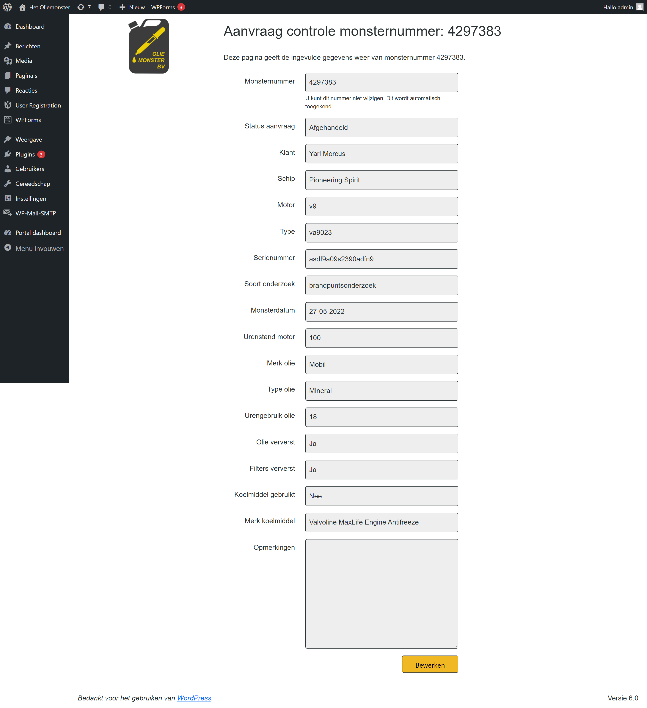

### Information page admin edit feature (previously submitted applications)
❗The whitespace on the left under the navigation menu is behavior that occurred when taking the screenshot.
Under normal circumstances (when scrolling the page), the navigation is fixed, and this whitespace will not be visible.

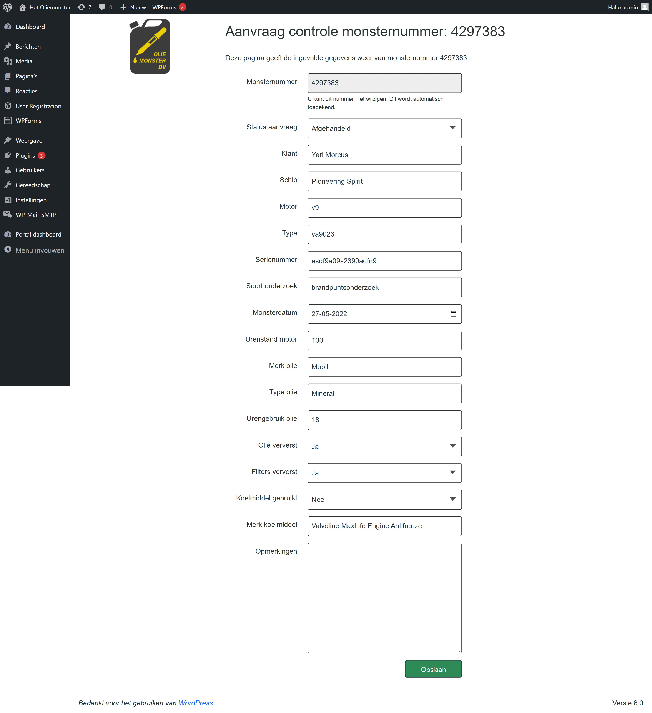

### Confirmation message editing status (previously submitted applications)
❗The dark space on the left under the navigation menu is behavior that occurred when taking the screenshot.
Under normal circumstances (when scrolling the page), the navigation is fixed, and this dark space will not be visible.

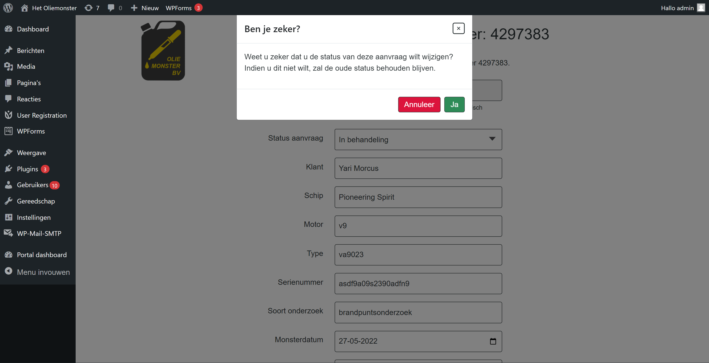
